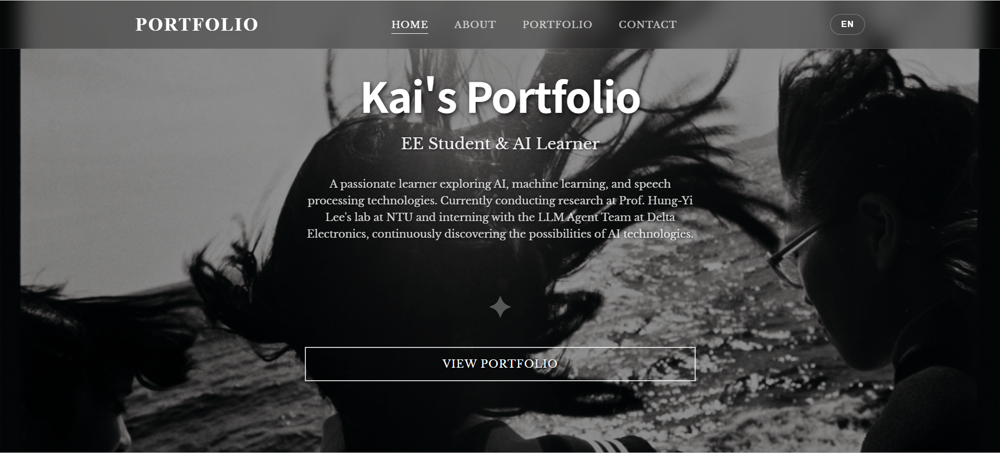

# Kai's Portfolio Website

Personal portfolio website for **Jia-Kai Dong** - EE Student & AI Researcher at National Taiwan University.



## 🚀 Features

- **Modern Design**: Clean, artistic design inspired by Daido Moriyama's photography style
- **Responsive Layout**: Optimized for desktop and mobile devices
- **TypeScript**: Fully typed JavaScript for better development experience
- **Multilingual**: Support for English and Traditional Chinese
- **Smooth Animations**: Page transitions and timeline animations
- **Interactive Timeline**: Professional experience and project timeline
- **Photography Gallery**: Personal photography work showcase

## 🎨 Design Philosophy

The website adopts a high-contrast black and white aesthetic inspired by legendary photographer Daido Moriyama, reflecting the intersection of technology and art that defines my work.

## 🛠 Tech Stack

- **Frontend**: HTML5, CSS3, TypeScript
- **Fonts**: 
  - Headers: Futura + Noto Sans TC
  - Body: Libre Baskerville + Noto Serif TC
- **Animation**: CSS transitions + Intersection Observer API
- **Build Tool**: TypeScript Compiler
- **Server**: Python HTTP Server

## 📁 Project Structure

```
kai-portfolio/
├── src/                       # TypeScript source code
│   ├── classes/
│   │   ├── PageFlipper.ts     # Page navigation logic
│   │   ├── TimelineAnimator.ts # Timeline animations
│   │   └── LanguageManager.ts # Language switching
│   ├── types/
│   │   └── index.ts          # TypeScript type definitions
│   └── main.ts               # Main application entry point
├── dist/                     # Compiled JavaScript files
│   ├── classes/              # Compiled class modules
│   └── main.js               # Main compiled entry point
├── assets/                   # Static assets
│   ├── DSC04162-1.jpg       # Personal photography
│   ├── DSC04190-1.jpg       # Personal photography  
│   ├── webpage.png          # Project screenshot
│   ├── 深瀨昌久_學生.png     # Masahisa Fukase artwork
│   └── 深瀨昌久_鴉.jpeg      # Masahisa Fukase artwork
├── artistic-portfolio.html   # Main HTML file
├── styles.css               # Legacy CSS file (embedded in HTML)
├── script.js                # Legacy JavaScript file
├── script.ts                # Legacy TypeScript file
├── tsconfig.json            # TypeScript configuration
├── package.json             # Project dependencies & scripts
├── package-lock.json        # Locked dependency versions
├── .gitignore              # Git ignore rules
├── LICENSE                 # MIT License
└── README.md               # Project documentation
```

## 🚀 Getting Started

### Prerequisites

- Node.js (v16 or higher)
- Python 3.x
- Modern web browser

### Installation

1. **Clone the repository**
   ```bash
   git clone https://github.com/snooow1029/wp1141.git
   cd wp1141/hw1
   ```

2. **Install dependencies**
   ```bash
   npm install
   ```

3. **Build TypeScript**
   ```bash
   npm run build
   ```

4. **Start development server**
   ```bash
   npm run serve
   ```

5. **Open in browser**
   Navigate to `http://localhost:8080`

## 🔧 Development

### Available Scripts

- `npm run build` - Compile TypeScript to JavaScript
- `npm run dev` - Watch mode for development
- `npm run serve` - Start local HTTP server
- `npm run start` - Build and serve
- `npm run clean` - Remove compiled files
- `npm run type-check` - Type checking without compilation

### Development Workflow

1. **Make changes** to TypeScript files in `src/`
2. **Run** `npm run dev` for automatic compilation
3. **Serve** the files with `npm run serve`
4. **Test** in browser at `localhost:8080`

## 📱 Features Overview

### Page Navigation
- **Full-page transitions** with smooth animations
- **Keyboard support** (Arrow keys)
- **Mouse wheel navigation** with content scroll priority
- **Touch gestures** for mobile devices

### Timeline Animation
- **Intersection Observer** for scroll-triggered animations
- **Alternating layout** for better visual flow
- **Responsive design** adapts to mobile screens

### Language Support
- **Bilingual content** (English/Traditional Chinese)
- **Dynamic switching** without page reload
- **Proper font handling** for different languages

## 🎯 About the Author

**Jia-Kai Dong** is a senior student in Electrical Engineering at National Taiwan University, passionate about AI, machine learning, and speech processing. Currently conducting research at Prof. Hung-Yi Lee's lab and interning with the LLM Agent Team at Delta Electronics.

### Interests
- 🤖 **AI & Machine Learning**: Speech processing, LLMs, deep learning
- ⚾ **Baseball**: Pitcher, inspired by Tyler Glasnow
- 📸 **Photography**: 2+ years experience, influenced by Masahisa Fukase
- 🎬 **Cinema**: Art house films and international cinema

### Experience Highlights
- **LLM Agent Team Intern** at Delta Electronics (2025-Present)
- **Teaching Assistant** for GenAI & ML at NTU (2025-Present)
- **Research Program** at SPML Lab, NTU (2025-Present)
- **Research Intern** at Academia Sinica (Summer 2024)

## 📞 Contact

- **Email**: [kaipnob@gmail.com](mailto:kaipnob@gmail.com)
- **GitHub**: [github.com/snooow1029](https://github.com/snooow1029)
- **LinkedIn**: [linkedin.com/in/kai-d-1621742a9](https://www.linkedin.com/in/kai-d-1621742a9/)
- **Photography**: [flickr.com/photos/196291108@N06](https://www.flickr.com/photos/196291108@N06/)

## 📄 License

This project is licensed under the MIT License - see the [LICENSE](LICENSE) file for details.

## 🙏 Acknowledgments

- **Masahisa Fukase** - Photography inspiration and background images
- **Daido Moriyama** - Design aesthetic inspiration
- **Prof. Hung-Yi Lee** - Academic mentorship
- **Delta Electronics** - Professional development opportunity

## 🔄 Version History

- **v1.0.0** (2025-01-09)
  - Initial release
  - TypeScript conversion
  - Full responsive design
  - Multilingual support
  - Timeline animations

---

*Built with ❤️ and TypeScript by Jia-Kai Dong*
