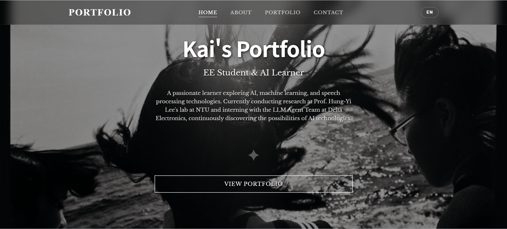

# Kai's Portfolio Website

🌐 **Live Website**: [https://snooow1029.github.io/](https://snooow1029.github.io/)

Personal portfolio website for **Jia-Kai Dong (董家愷)** - Electrical Engineering Student & AI Researcher at National Taiwan University.



## ✨ Features

- 🎨 **Artistic Design**: Inspired by Japanese photography aesthetics
- 📱 **Responsive Layout**: Works seamlessly on desktop and mobile
- 🌐 **Bilingual Support**: Traditional Chinese / English language switching
- ⚡ **Fast Loading**: Self-contained with embedded CSS and JavaScript
- 🔄 **Smooth Animations**: Page transitions and interactive timeline
- 📸 **Photography Gallery**: Personal photographic works showcase
- 🎯 **Interactive Timeline**: Professional experience and education

## 🚀 Quick Start

### Option 1: View Online (Recommended)
Simply visit: **[https://snooow1029.github.io/](https://snooow1029.github.io/)**

### Option 2: Run Locally

#### Method A: Direct File Access (Simplest)
1. Clone the repository:
   ```bash
   git clone https://github.com/snooow1029/snooow1029.github.io.git
   cd snooow1029.github.io
   ```

2. Open the website:
   ```bash
   # Option 1: Open in default browser
   open index.html        # macOS
   start index.html       # Windows
   xdg-open index.html    # Linux
   
   # Option 2: Double-click index.html in file manager
   ```

#### Method B: Local Development Server
1. Clone and setup:
   ```bash
   git clone https://github.com/snooow1029/snooow1029.github.io.git
   cd snooow1029.github.io
   npm install  # Optional: for development dependencies
   ```

2. Start local server:
   ```bash
   # Method 1: Using npm script
   npm run serve
   
   # Method 2: Using Python (more reliable)
   python3 -m http.server 8080
   
   # Method 3: Using Node.js http-server
   npx http-server -p 8080
   ```

3. Open in browser: `http://localhost:8080`

#### Method C: VS Code Live Server
1. Open the project in VS Code
2. Install "Live Server" extension
3. Right-click on `index.html` → "Open with Live Server"

## 🛠️ Development

### Prerequisites
- Node.js (v14 or higher)
- npm or yarn
- Python 3 (for local server)

### Development Workflow

1. **Clone and setup**:
   ```bash
   git clone https://github.com/snooow1029/snooow1029.github.io.git
   cd snooow1029.github.io
   npm install
   ```

2. **Development mode** (TypeScript compilation):
   ```bash
   # Watch for TypeScript changes
   npm run dev
   
   # In another terminal, start server
   npm run serve
   ```

3. **Make changes**:
   - Edit TypeScript files in `src/` directory
   - Modify HTML content in `index.html`
   - Update styles (embedded in HTML)
   - Add/replace images in `assets/` folder

4. **Build and test**:
   ```bash
   npm run build    # Compile TypeScript to JavaScript
   npm run start    # Build and serve
   ```

5. **Deploy**:
   ```bash
   git add .
   git commit -m "Update portfolio"
   git push origin main
   # GitHub Pages will automatically deploy the changes
   ```

## 📁 Project Structure

```
snooow1029.github.io/
├── index.html              # Main entry point (self-contained)
├── artistic-portfolio.html # Backup/alternative entry point
├── assets/                 # Static assets
│   ├── DSC04162-1.jpg     # Personal photography
│   ├── DSC04190-1.jpg     # Personal photography  
│   ├── webpage.png        # Screenshot for README
│   ├── 深瀨昌久_學生.png   # Art reference images
│   └── 深瀨昌久_鴉.jpeg    # Art reference images
├── src/                   # TypeScript source code
│   ├── classes/           # TypeScript classes
│   │   ├── LanguageManager.ts    # Language switching logic
│   │   ├── PageFlipper.ts        # Page navigation
│   │   └── TimelineAnimator.ts   # Timeline animations
│   ├── types/             # Type definitions
│   └── main.ts           # Main TypeScript entry
├── dist/                  # Compiled JavaScript (generated)
├── package.json          # npm configuration
├── tsconfig.json         # TypeScript configuration
├── script.js             # Standalone JavaScript (legacy)
├── script.ts             # Standalone TypeScript (legacy)
├── styles.css            # Standalone CSS (legacy)
└── README.md             # This file
```

## 🎨 Design & Typography

### Fonts
- **Headers/Navigation**: Bodoni MT with Noto Sans TC fallback
- **Body Text**: Libre Baskerville with Noto Serif TC fallback
- **Chinese Text**: Noto Sans TC and Noto Serif TC

### Color Scheme
- **Primary**: Black & White (inspired by Japanese street photography)
- **Accent**: Subtle grays for depth and hierarchy

### Photography Style
Inspired by **Daido Moriyama** and **Masahisa Fukase** - masters of Japanese street photography.

## 🌐 Architecture & Deployment

### GitHub Pages Integration
- **Automatic Deployment**: Push to `main` branch triggers deployment
- **Custom Domain Ready**: Can be configured in repository settings
- **HTTPS Enforced**: Secure connection by default

### Self-Contained Design
- All CSS and JavaScript are embedded in HTML files
- No external CDN dependencies
- Works offline after initial load
- Fast loading with minimal HTTP requests

## 🔧 Troubleshooting

### Common Issues

**1. TypeScript compilation errors:**
```bash
# Clean and rebuild
npm run clean
npm run build
```

**2. Server won't start in WSL:**
```bash
# Use Python server directly
python3 -c "import http.server; import socketserver; httpd = socketserver.TCPServer(('', 8080), http.server.SimpleHTTPRequestHandler); print('Serving at http://localhost:8080'); httpd.serve_forever()"
```

**3. Assets not loading:**
- Ensure you're accessing via `http://localhost:8080`, not `file://`
- Check that `assets/` folder is in the same directory as `index.html`

**4. Language switching not working:**
- Open browser developer tools and check console for JavaScript errors
- Ensure TypeScript has been compiled (`npm run build`)

## 📄 Scripts Reference

```json
{
  "build": "tsc",                    // Compile TypeScript
  "dev": "tsc --watch",              // Watch mode compilation
  "serve": "python3 -m http.server 8080",  // Start development server
  "start": "npm run build && npm run serve", // Build and serve
  "clean": "rm -rf dist",            // Clean compiled files
  "type-check": "tsc --noEmit"       // Type checking only
}
```

## 🤝 Contributing

1. Fork the repository
2. Create your feature branch (`git checkout -b feature/amazing-feature`)
3. Commit your changes (`git commit -m 'Add amazing feature'`)
4. Push to the branch (`git push origin feature/amazing-feature`)
5. Open a Pull Request

## 📞 Contact

- **Author**: Jia-Kai Dong (董家愷)
- **Email**: [kaipnob@gmail.com](mailto:kaipnob@gmail.com)
- **GitHub**: [@snooow1029](https://github.com/snooow1029)
- **LinkedIn**: [Kai Dong](https://www.linkedin.com/in/kai-d-1621742a9/)

## 📄 License

This project is licensed under the MIT License - see the [LICENSE](LICENSE) file for details.

## 🏆 Acknowledgments

- **Photography Inspiration**: Daido Moriyama, Masahisa Fukase
- **Typography**: Bodoni MT, Libre Baskerville font families
- **Hosting**: GitHub Pages
- **Development**: TypeScript, Modern Web Standards

---

**⭐ If you like this portfolio, please consider giving it a star!**

*Built with ❤️ using TypeScript and modern web technologies*
